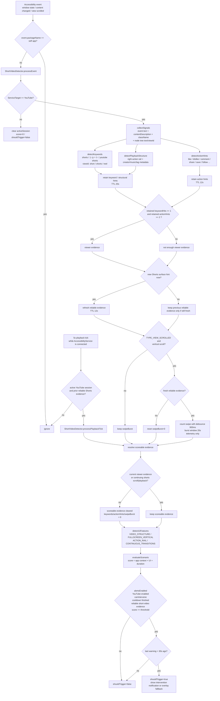

# Shortblocker Detection Logic

`ShortVideoAccessibilityService` と `ShortVideoDetector` の実ランタイム検知フローを図にしたメモです。

## Flow

## Key Conditions

| Item | Current value | Meaning |
| --- | --- | --- |
| `threshold` | `68` | 通知候補になるスコア閾値 |
| `REQUIRED_SHORTS_SWIPES` | `2` | `CONTINUOUS_TRANSITIONS` 表示用の目安 |
| `MIN_ACTION_RAIL_HINTS` | `2` | viewer evidence に必要な action hint 数 |
| `PLAYER_STRUCTURE_MIN_ACTION_HINTS` | `3` | Shorts 再生画面構造に必要な右側 action hint 数 |
| `MIN_STRONG_SHORTS_METADATA_HINTS` | `3` | `Shorts` 文字なしで構造検知する場合に必要なメタ情報数 |
| `SHORTS_KEYWORD_TTL_MS` | `20_000` | Shorts surface hint の保持時間 |
| `SHORTS_ACTION_HINT_TTL_MS` | `12_000` | action hint の保持時間 |
| `SHORTS_EVIDENCE_TTL_MS` | `12_000` | 信頼証拠の保持時間 |
| `SHORTS_SWIPE_DEBOUNCE_MS` | `900` | 重複 scroll event の除外時間 |
| `SCROLL_BURST_WINDOW_MS` | `20_000` | swipe burst を継続加算する時間窓 |
| `WARNING_RATE_LIMIT_MS` | `30_000` | 通知の rate limit |

## Notes

- 実ランタイムの `processEvent()` は現状 `YouTube` 以外を即除外します。
- `README.md` には Instagram / TikTok も書かれていますが、通知発火ロジックはまだ YouTube Shorts 寄りです。
- 時間帯は `timeBand` として保持されますが、スコア加点には使っていません。
- スコア配分は `App Context 20` / `Viewer Surface Confidence 55` / `Persistence 25` の合計 `100` 点です。
- `keyword` と `action hint` は別 TTL で保持し、信頼証拠の更新は新しい Shorts surface hint または再生画面構造を見た時だけ行います。
- Shorts 再生中に `Shorts` 文字列が画面上部へ出ないケースは、右側アクション列 + 投稿者/Subscribe/音源/ハッシュタグ系メタ情報で `ui:shorts-player` として扱います。
- 一度 reliable Shorts evidence を掴んだ後は、5 秒ごとの playback tick でも保持証拠をスコア化し、停止/スクロール操作を待たずに session/dwell score が進みます。MediaSession はログ用の補助情報として扱い、Shorts 再生が `unknown` に見える端末でも tick は止めません。
- `Usage Stats` と通知権限は監視表示には残りますが、発火可否の必須条件からは外しています。
- `swipeBurst` はログと `CONTINUOUS_TRANSITIONS` の補助指標として残していますが、通知発火条件とスコア計算には使っていません。
- UI 上の「介入候補」は `score >= threshold` で出ますが、通知発火はそれより厳しい条件です。
