# Shortblocker Detection Logic

`ShortVideoAccessibilityService` と `ShortVideoDetector` の実ランタイム検知フローを図にしたメモです。

## Flow

```mermaid
flowchart TD
    A[Accessibility event<br/>window state / content changed / view scrolled] --> B{event.packageName == self app?}
    B -- yes --> Z1[ignore]
    B -- no --> C[ShortVideoDetector.processEvent]

    C --> D{ServiceTarget == YouTube?}
    D -- no --> E[clear activeSession<br/>score=0 / shouldTrigger=false]
    D -- yes --> F[collectSignals<br/>event text + contentDescription + className<br/>+ node tree text/viewId]

    F --> G[detectKeywords<br/>shorts / ショート / youtube shorts<br/>viewId: short / shorts / reel]
    F --> H[detectActionHints<br/>like / comment / share / save / follow ...]

    G --> I[update candidate evidence<br/>TTL 20s]
    H --> I

    I --> J{keywordHits >= 1<br/>and actionHints >= 2 ?}
    J -- yes --> K[viewer evidence]
    J -- no --> L[not enough viewer evidence]

    K --> M[reliable evidence TTL 12s]
    L --> M

    M --> N{TYPE_VIEW_SCROLLED and<br/>vertical scroll?}
    N -- no --> O[keep swipeBurst]
    N -- yes --> P{fresh reliable evidence?}
    P -- no --> Q[reset swipeBurst=0]
    P -- yes --> R[count swipe with debounce 900ms<br/>burst window 20s]

    O --> S[resolve scoreable evidence]
    Q --> S
    R --> S

    S --> T{current viewer evidence<br/>or continuing shorts scroll?}
    T -- no --> U[scoreable evidence cleared<br/>keywords/actionHints/swipeBurst = 0]
    T -- yes --> V[keep scoreable evidence]

    U --> W[detectUiFeatures]
    V --> W[detectUiFeatures<br/>VIDEO_STRUCTURE / FULLSCREEN_VERTICAL<br/>ACTION_RAIL / CONTINUOUS_TRANSITIONS]

    W --> X[evaluateScenario<br/>score = app context + UI + swipe + duration]
    X --> Y{alertsEnabled<br/>YouTube enabled<br/>all permissions granted<br/>cooldown finished<br/>reliable short-video evidence<br/>swipeBurst >= 2<br/>score >= threshold}

    Y -- no --> Z2[shouldTrigger=false]
    Y -- yes --> AA{last warning > 30s ago?}
    AA -- no --> Z2
    AA -- yes --> AB[shouldTrigger=true<br/>show intervention notification]
```

## Key Conditions

| Item | Current value | Meaning |
| --- | --- | --- |
| `threshold` | `62` | 通知候補になるスコア閾値 |
| `REQUIRED_SHORTS_SWIPES` | `2` | 発火に必要な Shorts 縦スワイプ数 |
| `MIN_ACTION_RAIL_HINTS` | `2` | viewer evidence に必要な action hint 数 |
| `SHORTS_CANDIDATE_TTL_MS` | `20_000` | 候補証拠の保持時間 |
| `SHORTS_EVIDENCE_TTL_MS` | `12_000` | 信頼証拠の保持時間 |
| `SHORTS_SWIPE_DEBOUNCE_MS` | `900` | 重複 scroll event の除外時間 |
| `SCROLL_BURST_WINDOW_MS` | `20_000` | swipe burst を継続加算する時間窓 |
| `WARNING_RATE_LIMIT_MS` | `30_000` | 通知の rate limit |

## Notes

- 実ランタイムの `processEvent()` は現状 `YouTube` 以外を即除外します。
- `README.md` には Instagram / TikTok も書かれていますが、通知発火ロジックはまだ YouTube Shorts 寄りです。
- 時間帯は `timeBand` として保持されますが、スコア加点には使っていません。
- UI 上の「介入候補」は `score >= threshold` で出ますが、通知発火はそれより厳しい条件です。
