# ドーパミン警察

ショート動画を見続けてしまう状態を検知し、キャラクター通知と警告オーバーレイで止めに入る Android アプリです。

## 概要

- YouTube Shorts の画面構造を Accessibility Service で取得
- 画面テキスト / View ID / ノード位置から「Shorts らしさ」をスコア化
- 一定時間以上「見続けている」と判断したら介入（通知 / オーバーレイ）
- 視聴時間を日次・週次で記録

## 開発の目的

ショート動画は、1本だけのつもりでも次々と見てしまいやすい UI です。  
このアプリは視聴を強制ブロックせず、見続けているタイミングを検知して「今やめるきっかけ」を作ることを目的にしています。

## 主な機能

- YouTube Shorts のルールベース検知
- Shorts らしさのスコアリングと閾値超え時間の計測
- 目標時間 / 検知タイミング設定
- キャラクター通知、GIF + サイレン警告オーバーレイ
- DataStore への設定 / 視聴時間保存

## 画面

- ホーム: 今日の視聴時間、週間履歴、目標時間
- 設定: 権限状態、1日の目標、検知タイミング

## セットアップ

初回起動後、次の権限を有効化してください。

1. 操作補助
2. 使用状況
3. メディア
4. 通知


## ビルド

```bash
./gradlew assembleDebug
```

生成 APK:

```bash
app/build/outputs/apk/debug/app-debug.apk
```

## UI

<p align="center">
  
  
</p>

## 発表スライド


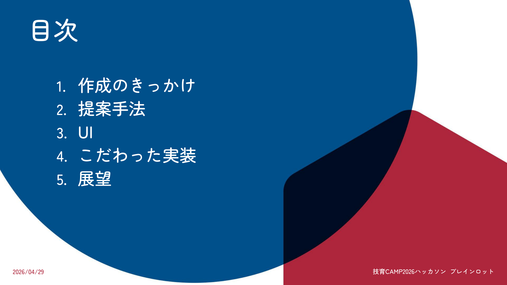
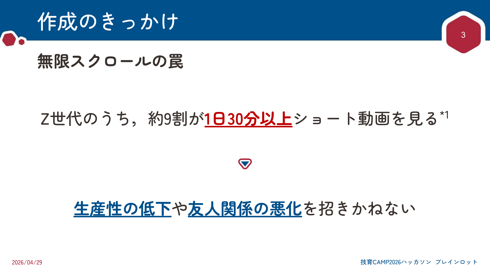
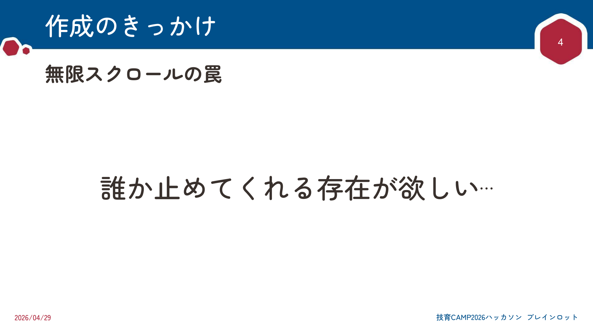
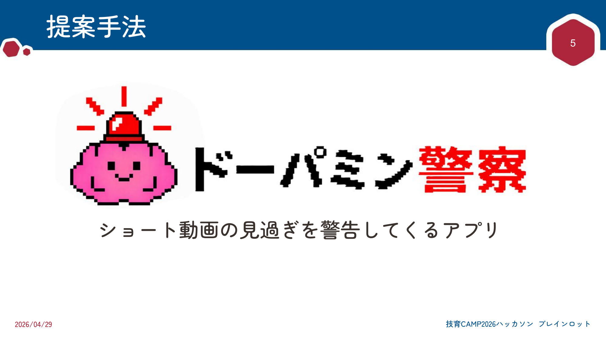
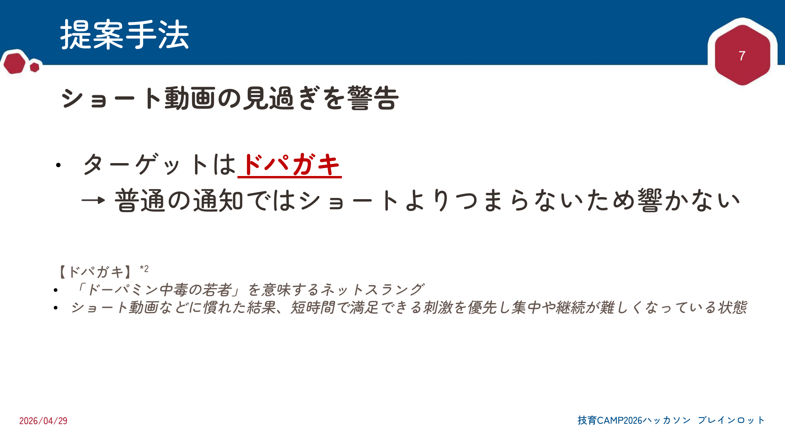
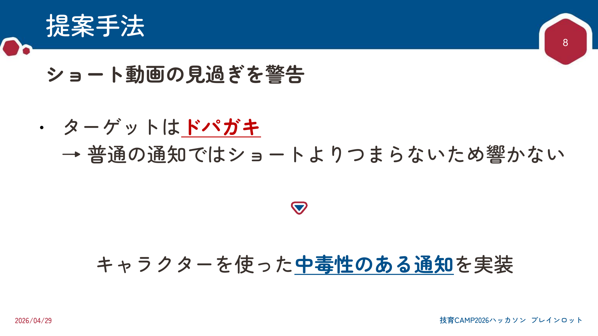
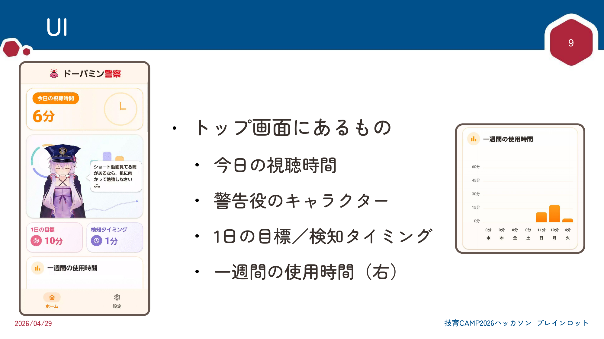
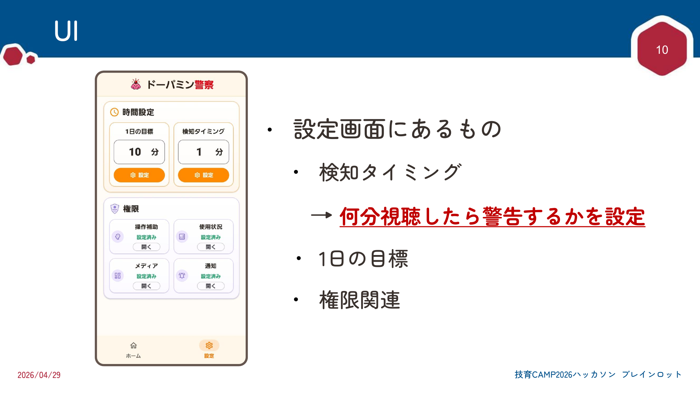
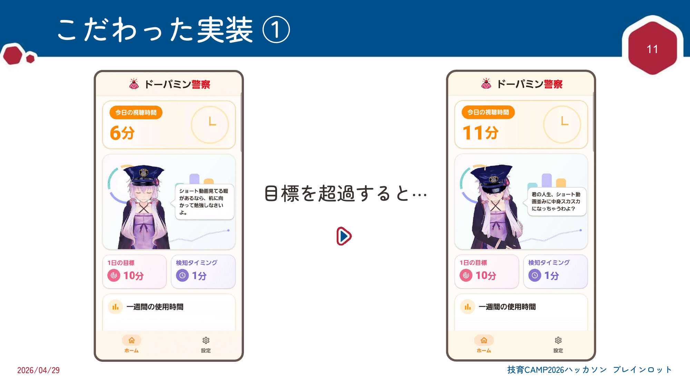
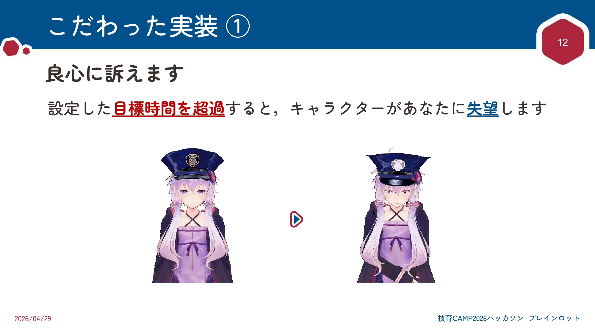
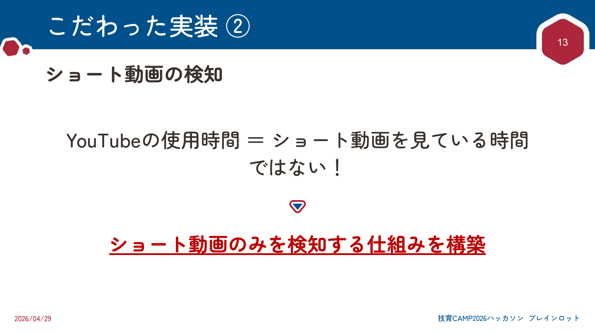
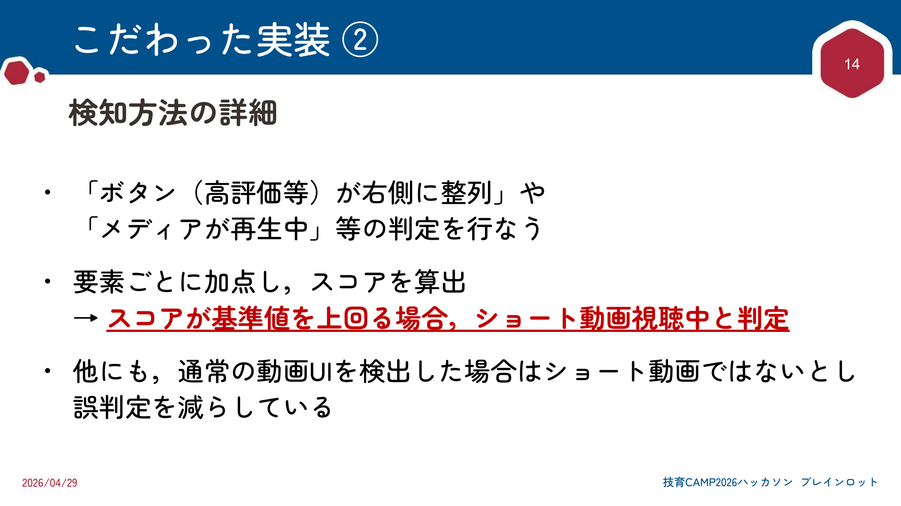
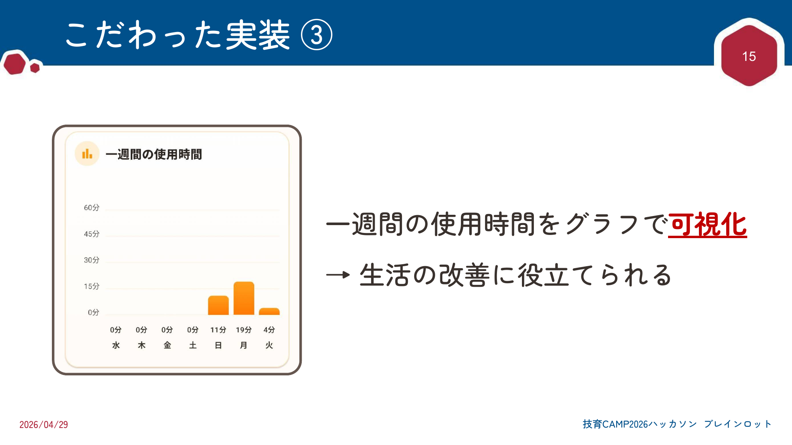
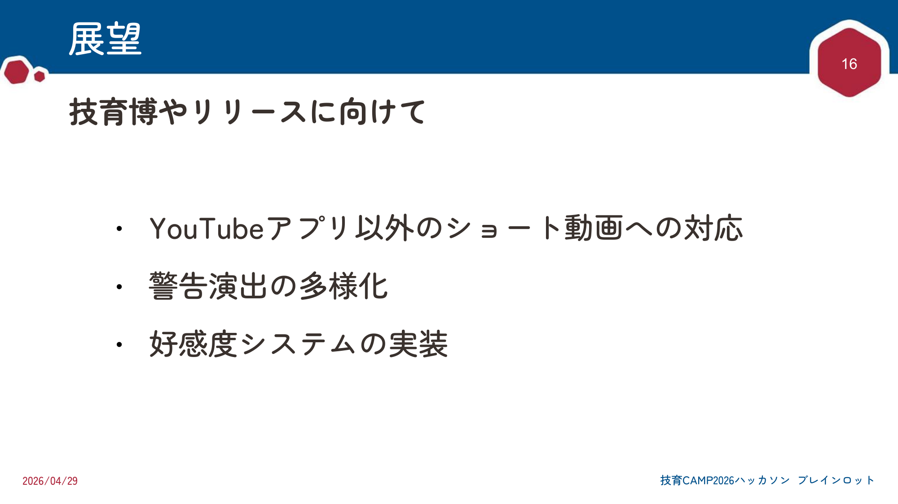
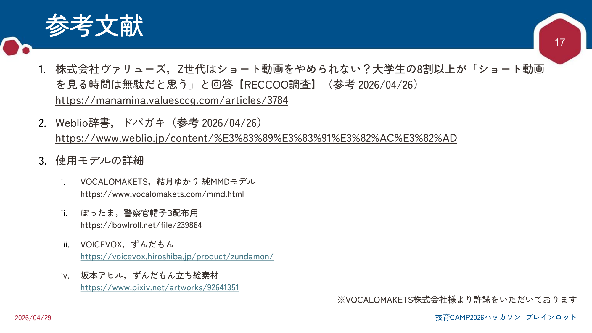

## 動作例

<p align="center">
  <video src="https://github.com/user-attachments/assets/3afbaab4-5b8c-433a-95d1-64c97ef092ee" controls width="70%"></video>
</p>
