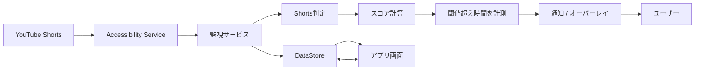

# ドーパミン警察

ショート動画を見続けてしまう状態を検知し、キャラクター通知と警告オーバーレイで止めに入る Android アプリです。

YouTube Shorts の画面構造を Accessibility Service で読み取り、Shorts らしさをスコア化します。一定時間以上「見続けている」と判断した場合に、通知やオーバーレイでユーザーへ介入します。

## 何を解決するか

ショート動画は、1本だけのつもりでも次々と見てしまいやすい UI になっています。  
このアプリは、視聴そのものを強制的にブロックするのではなく、見続けているタイミングを検知して「今やめるきっかけ」を作ることを目的にしています。

## デモで見せたい体験

1. アプリで目標時間と検知タイミングを設定する
2. YouTube Shorts を見続ける
3. アプリが Shorts 画面らしさを検知してスコア化する
4. 閾値超え状態が一定時間続く
5. 通知とオーバーレイで「そろそろやめよう」と介入する
6. ホーム画面で今日の視聴時間と週間履歴を確認する

## 主な機能

- YouTube Shorts 画面のルールベース検知
- Accessibility Service による画面テキスト / View ID / ノード位置の収集
- Shorts らしさのスコアリング
- 閾値超え状態が続いた時間の計測
- キャラクター通知
- GIF とサイレンによる警告オーバーレイ
- 今日の視聴時間と週間履歴の表示
- 目標時間と検知タイミングの設定
- DataStore による設定・監視状態・視聴時間の保存
- ランチャーアイコン切り替え

## 現在の実装範囲

実装上は YouTube / Instagram / TikTok の対象定義がありますが、実際のランタイム検知と介入は **YouTube Shorts 中心**です。

Instagram Reels と TikTok For You は、今後拡張するためのモデル定義やデモ用データとして残っています。

## システム構成



アプリ画面は Jetpack Compose で作られています。監視サービスはバックグラウンドで YouTube の画面変化を受け取り、検知結果や視聴時間を DataStore に保存します。

## Shorts 判定の考え方

単に YouTube を開いているだけでは警告しません。  
通常動画やホーム画面と区別するために、複数の証拠を組み合わせています。

見ている主な証拠:

- `Shorts` / `ショート` という表示がある
- `Like` / `Comment` / `Share` / `Save` などのボタンがある
- それらのボタンが画面右側に並んでいる
- Shorts の見出しが画面上部寄りにある
- 縦スクロールが続いている
- 通常動画に多いシークバーや全画面ボタンが目立たない

判定の流れ:

```text
画面イベントを受け取る
  ↓
YouTube か確認する
  ↓
画面の文字・ボタン・位置情報を集める
  ↓
Shorts らしい証拠を探す
  ↓
通常動画っぽい UI は除外する
  ↓
スコア化する
  ↓
閾値超え状態が続いたら介入する
```

## スコアリング

スコアは、主に次の要素から計算します。

| 観点 | 内容 |
| --- | --- |
| 対象アプリ | YouTube か、短時間で再突入しているか |
| 画面構造 | Shorts 表示、右側アクション列、縦動画らしい構造があるか |
| 継続性 | その状態で何分見ているか、同じ画面にどれくらい滞在しているか |
| 再生状態 | MediaSession で再生中らしいか |

MediaSession は動画を止めるためには使っていません。再生中かどうかを補助的に見るためのセンサーとして使っています。

## 介入の仕組み

スコアが閾値を超えても、すぐには警告しません。  
誤検知を減らすために、閾値を超えた状態が設定時間続いた場合だけ介入します。

```text
score < 閾値
  → 監視を続ける

score >= 閾値
  → 閾値超え時間を累積する

累積時間 >= 設定した検知タイミング
  → 通知とオーバーレイで介入する
```

介入では、通常の通知に加えて、オーバーレイ権限がある場合は GIF とサイレンを画面上に表示します。

## 技術スタック

- Kotlin
- Android
- Jetpack Compose
- Material 3
- Kotlin Coroutines / StateFlow
- Android DataStore
- Accessibility Service
- Notification Listener / MediaSession
- Foreground Service / Overlay
- Coil GIF
- Gradle / Android Gradle Plugin

## 画面

- ホーム: 今日の視聴時間、週間履歴、目標時間を表示
- 設定: 権限状態、1日の目標、検知タイミングを設定

## 初回セットアップ

アプリ起動後、Android の設定から以下を有効化してください。

1. Accessibility Service
2. Usage Stats
3. 通知権限
4. オーバーレイ権限
5. 通知リスナー権限

最低限の検知には Accessibility Service が重要です。通知やオーバーレイは、介入を表示するために使います。

## ビルド

Android Studio でこのリポジトリを開くか、ルートで以下を実行します。

```bash
./gradlew assembleDebug
```

生成される APK:

```bash
app/build/outputs/apk/debug/app-debug.apk
```

## ディレクトリ

```text
app/
  src/main/java/dev/shortblocker/app/
    data/      設定・状態・ログのモデルと DataStore
    domain/    検知、通知、権限、オーバーレイなどの実処理
    ui/        Jetpack Compose の画面

Prototype.md                 元になったプロトタイプ仕様
DetectionLogicDiagram.md     検知ロジックの詳細メモ
```

## 現状の課題

- 実ランタイムの介入対象はまだ YouTube Shorts 中心
- Instagram / TikTok 対応は今後の拡張
- 通知アクションの接続は改善余地あり
- 全画面縦動画判定は、厳密な動画領域判定ではなく UI 構造からの推定
- 検知タイミングとクールダウン設定の意味が一部兼用されている

## 発表での要点

このアプリの特徴は、単純に YouTube をブロックするのではなく、Shorts らしい UI 構造と視聴継続時間を見て、必要なタイミングで介入する点です。

「検知」「スコアリング」「一定時間の確認」「キャラクター介入」を組み合わせることで、強制ブロックではなく、ユーザーが自分で止まるためのきっかけを作るアプリになっています。
